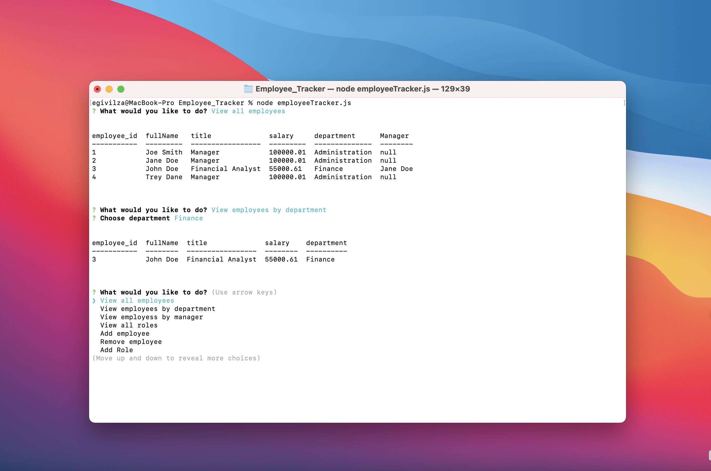

# Employee_Tracker

## Description

This project is to demonstrate a employee management system that has the functionality to view, add, and remove employees/departments/roles through the use of mysql and npm inquirer (by using the console terminal). Three tables are created in the mysql database (employees/departments/roles) and foreign keys are used to display the relationship of the employee with the manager, department, and role.

# Table of Contents

* [Screenshot](#screenshot)

* [Installation](#installation)

* [Built With](#builtwith)

* [License](#license)

* [Questions](#questions)

## Screenshot

## Installation

To install necessary dependencies, run the following command:

''
npm i
''

## Built With

* Javascript
* Node Inquirer
* mysql
* schema

## License

This projects is licensed under the MIT license.

## Questions

If you have any questions about the repo, open an issue or contact me at egivilza@email.com.
You can find more of my work at: [egivilza](https://github.com/egivilza).

